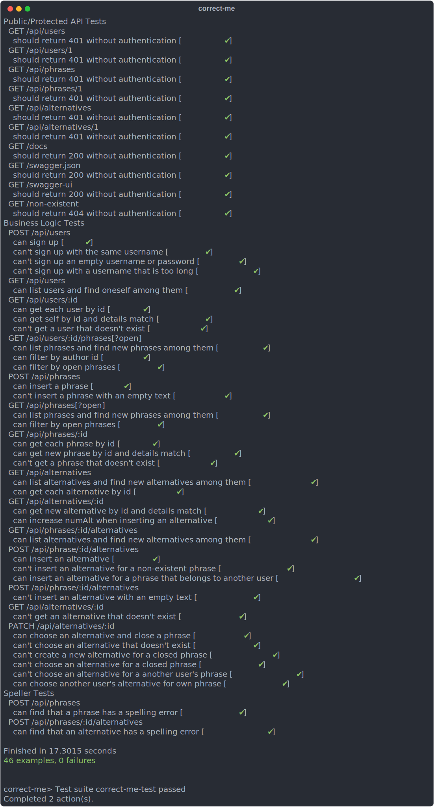

# correct-me


`correct-me` is a prototype backend API designed for team collaboration. It allows users to upload message formulations, suggest alternatives, and choose the best version. Each message is also checked for spelling errors using a service like Yandex Speller, with errors displayed for review.

API Use Cases:

- *Sign up and authenticate*: Secure access to the service.
- *Submit a new phrase*: Users can submit phrases for review.
- *View and filter phrases*: Users can view unresolved phrases or those they authored.
- *Submit a new alternative*: Users can suggest alternative versions for others' phrases.
- *View and filter alternatives*: Users can view alternatives and filter them by phrase, author or date of submission.
- *Mark best alternative*: Authors can select the best alternative phrase to resolve a submission.
- *Automatic spell-check*: Each phrase and alternative are automatically checked for spelling errors, with a list of errors provided.

Technologies Used:

1. Haskell
2. Servant
3. Postgres (hasql)
4. wreq / http-conduit
5. Swagger UI

The API is protected by [BasicAuth](https://en.wikipedia.org/wiki/Basic_access_authentication) or [JWT](https://jwt.io/). To access them, you need to register by issuing a POST request to `/api/users`. See [API Documentation](docs/api_docs.md) or see the [section](#api-documentation) below for details.

## Running the application

You can run the application either with `stack` or using `docker-compose`. The API can be accessed at `localhost:8080` or at whatever host/port is specified in `config.toml`.

### Build manually

1. Ensure you have [Stack](https://docs.haskellstack.org/en/stable/README/) installed and a [Postgres](https://www.postgresql.org/download/) database running.
2. Clone the repository:
   ```sh
   git clone https://github.com/almayor/correct-me.git
   cd correct-me
   ```
3. Add the credentials needed to access the Postgres database to the `config.toml` file.
4. Build and run the application:
   ```sh
   stack build
   stack run
   ```

### Use Docker Compose

1. Ensure you have [Docker](https://docs.docker.com/get-docker/) and [Docker Compose](https://docs.docker.com/compose/install/) installed.
2. Clone the repository:
   ```sh
   git clone https://github.com/almayor/correct-me.git
   cd correct-me
   ```
3. Build and run the Docker containers:
   ```sh
   docker-compose up
   ```

## Testing the application

I am using [hspec](https://hackage.haskell.org/package/hspec) for testing. You can run the tests as follows:

```sh
docker-compose run --entrypoint stack app test
```

<details>
<summary>Example output</summary>
</br>
</details>

## CI/CD

Github Actions have been set up to continuously
1. test the project
2. re-build the Docker image and push it to [Docker Hub](https://hub.docker.com/r/almayor/correct-me)
3. update the [API Documentation](docs/api_docs.md)

## API Documentation

- **Servant Docs**: The API documentation generated by Servant can be accessed at `/docs`. The Markdown file can also be accessed [here](docs/api_docs.md).
- **Swagger UI**: The Swagger UI for the API can be accessed at `/swagger-ui`.

## TO-DO

- [ ] Build a front-end client for the API
- [ ] Add more tests
- [ ] [List alternative responses and exceptions](https://docs.servant.dev/en/stable/cookbook/uverb/UVerb.html) in Swagger and Servant.Docs
- [ ] Use pagination with [servant-pagination](https://hackage.haskell.org/package/servant-pagination)
- [ ] Use Redis to cache requests
- [ ] Implement rate limiting to prevent abuse
- [ ] Add monitoring and alerting for the application
- [ ] Slim down Docker image by leveraging two-stage builds
